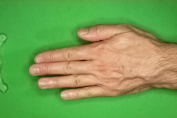
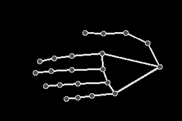

<!-- PROJECT -->
# About The Project
## Project Introduction

The goal of this project, is to create an improved implementation of the game "rock paper scissors" that a human can play vs a computer through the use of a convolutional neural network, based on previous work done in [RPS_flask](https://github.com/shepherdm1atwit/RPS_flask) using knowledge gained since it's creation. The computer chooses random hand signs to play, but uses a combination of Google's MediaPipe and a custom Keras image classification model running on a flask backend to recieve images from a web client and determine which hand sign the user is showing the camera, then providing the result based on it's prediction of the hand sign shown and the . This model has been fully deployed on a private server using Nginx and Gunicorn, and is currently live to be tested using a webcam or phone camera by simply visiting [rps.CodeSmith.link](https://rps.codesmith.link).

## Data Selection / Feature Extraction
The dataset I chose to use for this project is a modified version of the "Rock-Paper-Scissors Images" dataset by [Julien de la Bruère-Terreault](https://github.com/imfdlh), found [here](https://www.kaggle.com/datasets/drgfreeman/rockpaperscissors). I chose this dataset because it contains approximately 700 images each of hands holding up rock, paper, and scissors hand signs. This dataset also has the benefit of consistent camera angles, lighting, and background across all images, as well as pictures of hands of different shapes, sizes, and skin colors to improve flexibility. Google's [MediaPipe](https://google.github.io/mediapipe/) was used to perform feature extraction, simplifying each image into a much more basic version by converting from full color and detail images of hands into greyscale "skeletons" with dots to represent each joint and lines to represent segments of the hand. This greatly simplifies the features that the convolutional neural network needs to learn, allowing for my model to focus entirely on learning to recognize the shape of each hand sign in order to classify them into the corect category, rather than having to differentiate the hand from the surrounding environment before attempting to classify it into a hand sign. An example of an original and feature extracted image can be seen below, showing how much MediaPipe allows the dataset's original images to be simplified.<br>


## Model Training
Once the feature extraction on the dataset was completed using [convert_greyscale.py](https://github.com/shepherdm1atwit/CNN_RPS/blob/70c34c908758c1f5118538f87292df6ffdabb5f7/train_test/convert_grayscale.py), the images were loaded and the augmented using a Keras **ImageDataGenerator**. This not only means that the images do not all need to be loaded all at once, saving on system memory usage, but also allows for the augmentation of the training data via rotation, vertically and horizontally flipping the images, and randomly sheering and zooming the images within specified ranges to prevent overfitting and improve real-world performance. Using an **ImageDataGenerator** also allows for the dataset to be more easily split into training and validation data, which can be used both during and after training to evaluate the accuracy of the model on held-out data. The neural netowrk itself consists of five 2d convolution layers, each with it's own max pooling layer and a 20% dropout to prevent overfitting, finally ending with a set of dense layers for the categorical output. The model was then compiled using a loss of `categorical_crossentropy` for classification with more than two categories, and the `Adam` optimizer from Keras.  50 epochs were used to ensure the highest possible accuracy without overfitting. Below, a graph of training and validation accuracy during each epoch can be seen, showing both the trainging and validation accuracy plateau as the model nears 50 epochs of training.<br><br>
All information related to the model's training can be found in [train_model.py](train_test/train_model.py).

### Methods/Tools Used:

* [Keras](https://keras.io/)/[TensorFlow](https://www.tensorflow.org/)/[Scikit-learn](https://scikit-learn.org/stable/) for the creation of the Convolutional Neural Network.
* [MediaPipe](https://google.github.io/mediapipe/) for feature extraction before training and prediction.
* [Matplotlib](https://matplotlib.org/) for visualizing images, plots, and confusion matrices.
* [NumPy](https://numpy.org/) for data manipulation.
* [OpenCV](https://opencv.org/) for image manipulation.
* [Flask](https://flask.palletsprojects.com/) for hosting model on python backend and [JQuery](https://jquery.com) for sending webcam images to backend for prediction.
* [NGINX](https://www.nginx.com/) and [gUnicorn](https://gunicorn.org/) for deploying and hosting flask server running latest model on private server.

## Analysis/Results
As shown above, the model ended up with an accuracy of 97% on training data and 98% on held out validation data, lending to it's remarkable levels of accuracy when tested on validation data as well as real-world data in a deployed setting. A confusion matrix showing the high accuracy of the model and it's few misclassifications when tested on validation data can be found below:<br>

## Final Presentation
For presentation slides, please see the [final presentation](https://github.com/shepherdm1atwit/CNN_RPS/blob/c1d19be22d46a33e167608c35d3d88e48723c69a/ADL%20Final.pptx).

<!-- Deployment -->
# Deployment

## Basic/Local Setup - Python
**This setup is** *much* **simpler than the advanced setup, but is made to be temporary, not a "production" deployment**
1. Make sure `Python3`, `pip`, and `virtualenv` are installed on your system before continuing
2. Clone the repo and enter the directory it creates

   ```sh
   git clone https://github.com/shepherdm1atwit/CNN_RPS
   cd CNN_RPS
   ```
3. Create a python virtual environment and activate it
   
   ```python
   virtualenv rps
   source rps/bin/activate
   ``` 
   If running on Windows, use the following in place of `source rps/bin/activate`
   ```bat
   .\rps\Scripts\activate
   ```
   
4. Install required dependencies and run app.py
   
   ```python
   pip install -r requirements.txt
   python app.py
   ```

## Advanced/Persistent Setup - Nginx with gUnicorn
**This will create a persistent server accessable via your domain name and is intended for use as a "production" deployment**\

**Note: This setup is linux-only due to the usage of systemd and gUnicorn**

### Part 1: Python and Initial Setup
1. Make sure `Python3`, `pip`, `virtualenv`, and `nginx` are installed on your system before continuing
2. Clone the repo and enter the directory it creates

   ```sh
   git clone https://github.com/shepherdm1atwit/CNN_RPS
   cd CNN_RPS
   ``` 
   *the rest of the tutorial will assume you have cloned the repository to `/var/www`*
3. Create a python virtual environment and activate it
   
   ```python
   virtualenv rps
   source rps/bin/activate
   ``` 
4. Install required dependencies and deactivate virtual environment
   
   ```python
   pip install -r requirements.txt
   pip install wheel
   pip install gunicorn
   deactivate
   ```
   
### Part 2: Systemd Service Creation
1. Create the `CNN_RPS.service` file to start the application at boot
   ```sh
   sudo nano /etc/systemd/system/CNN_RPS.service
   ```
2. Fill `CNN_RPS.service` with the following (replacing <YOUR_USERNAME> with your username and updating paths if neccsary

   ```
   [Unit]
   Description=Gunicorn instance to serve CNN_RPS
   After=network.target

   [Service]
   User= <YOUR_USERNAME>
   Group=www-data
   WorkingDirectory=/var/www/CNN_RPS
   Environment="PATH=/var/www/CNN_RPS/rps/bin"
   ExecStart=/var/www/CNN_RPS/rps/bin/gunicorn --workers 3 --bind unix:CNN_RPS.sock -m 007 wsgi:app

   [Install]
   WantedBy=multi-user.target
   ```
3. Start and enable the newly created `CNN_RPS` service
   
   ```sh
   sudo systemctl start CNN_RPS
   sudo systemctl enable CNN_RPS
   ```

### Part 3: Nginx Configuration
1. Create a Nginx server configuration file called `CNN_RPS` in `sites-available`
   
   ```sh
   sudo nano /etc/nginx/sites-available/CNN_RPS
   ```
2. Fill this newly created file with, replacing `yourdomain` with your domain name and updating the path if neccsary
   
   ```
   server {
      listen 80;
      server_name yourdomain www.yourdomain;
      location / {
         include proxy_params;
         proxy_pass http://unix:/var/www/CNN_RPS/CNN_RPS.sock;
      }
   }
   ```
 
3. Link the file to the `/etc/nginx/sites-enabled` directory

   ```sh
   sudo ln -s /etc/nginx/sites-available/CNN_RPS /etc/nginx/sites-enabled
   ```

4. Restart Nginx to apply changes

   ```sh
   sudo systemctl restart nginx
   ```
### Part 4: SSL Configuration - Note: this example uses [CertBot](https://certbot.eff.org/) and [LetsEncrypt](https://letsencrypt.org/)
   Install and run CertBot, replacing `yourdomain` with your domain name - Note: certbot will ask for an email and TOS agreement the first time
   
   ```sh
   sudo add-apt-repository ppa:certbot/certbot
   sudo apt install python-certbot-nginx
   sudo certbot --nginx -d yourdomain -d www.yourdomain
   ```

<!-- USAGE EXAMPLES -->
## Usage

Once your flask server is running, either in development mode through `python app.py` or on your server, simply 
visit the webpage by going to `www.yourdomain` or `localhost` and enjoy.


<!-- ACKNOWLEDGMENTS -->
## Acknowledgments

* Dataset is modified work by [Julien de la Bruère-Terreault](https://github.com/imfdlh)
* Project based on previous work done alongside [Connor Rogers](https://github.com/Connor-Rogers)
